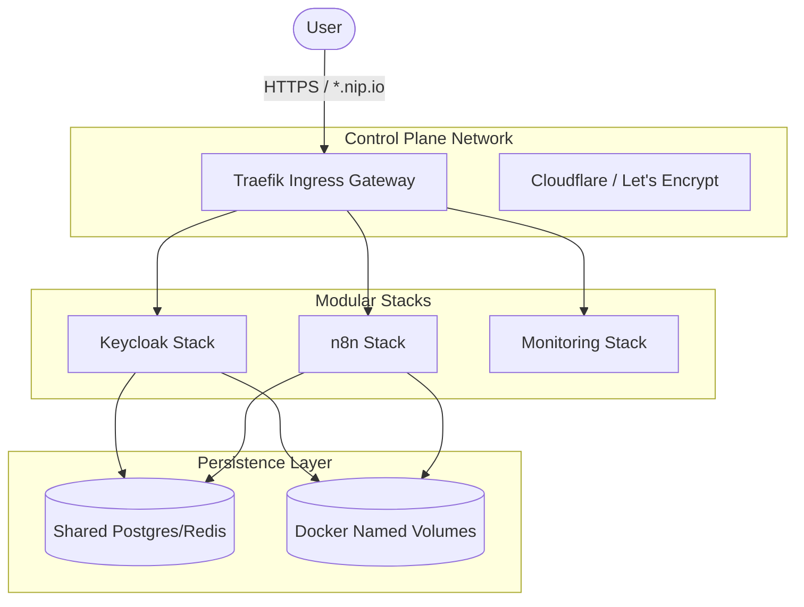

# ☁️ CloudOps-Sandbox
## A Production-Grade Local Cloud Architecture

A modular, automated infrastructure sandbox for testing cloud-native stacks, observability, and automation tools on your laptop or a remote VM.

> [!TIP]
> This lab mimics a production cloud environment with modular stacks and unified ingress.

## 🏗️ Architecture: The "Local Cloud" Design

Unlike standard local labs, **CloudOps-Sandbox** is built with a platform engineering mindset. It separates ingress, control-plane logic, and modular application stacks.



## 🚀 Overview

This lab provides a "Sandboxed" environment that mimics a production cloud setup. It allows for the rapid deployment of stateful tools and management stacks using Docker and Traefik as a unified entry point.

---

## 📋 Prerequisites

### Domain Setup (Choose One)

#### Option A: Public Domain (Recommended)
If you have a public domain (e.g., managed via Cloudflare):
1.  Point a wildcard record (e.g., `*.lab.yourdomain.com`) to `127.0.0.1` (for local) or your **Remote VM Public IP**.
2.  Create a Cloudflare API Token with `DNS:Edit` permissions.
3.  This allows Traefik to use DNS challenges for real wildcard SSL certificates.

#### Option B: No Public Domain (The "Zero-Config" Way)
If you don't have a domain, you can use **[nip.io](https://nip.io)**:
1.  Set `APP_DOMAIN` in your `.env` to `127.0.0.1.nip.io`.
2.  Access stacks at `https://grafana.127.0.0.1.nip.io`.
3.  *Note: Traefik will use self-signed certificates in this mode unless configured otherwise.*

### System Requirements
*   **Operating System**: macOS or Linux.
*   **Docker**: Docker Desktop (Mac) or Docker Engine (Linux).
*   **Tools**: `make`, `envsubst` (via `gettext` package on Linux).

---

## 🏗️ Stack Catalog

The lab is organized into modular stacks:

| Category | Tools | Description |
| :--- | :--- | :--- |
| **Edge & Proxy** | Traefik | Wildcard SSL, Basic Auth, and Auto-Discovery |
| **Observability** | Prometheus, Grafana, WUD | Metrics, Dashboards, and Update Notifications |
| **Automation** | n8n | Low-code workflow automation |
| **Databases** | PostgreSQL, MySQL | Stateful data persistence |
| **Identity** | Keycloak | Identity and Access Management (OIDC/SAML) |
| **Management** | Portainer, Adminer, phpMyAdmin | Container and DB management UIs |

---

## 🛠️ Quick Start

### 1. Initialize Environment
Copy the global template and configure your domain:
```bash
cp .env.template .env
# Edit .env with your domain and CF_DNS_API_TOKEN
```

### 2. Setup Infrastructure
Initialize the Docker network and generate stack-specific `.env` files:
```bash
make setup
```

### 3. Launch Stack
Start the core infrastructure and all stacks:
```bash
make up
```

### 4. Database Syncing (Optional)
If you add a new app that needs a database while the lab is already running, run:
```bash
make sync-dbs
```
This safely provisions new databases and users without restarting the DB engine.

---

## ➕ How to Add a New Stack

Adding a new tool to the lab is standardized:

1.  **Create Directory**: `mkdir -p stacks/my-new-tool`
2.  **Add Compose**: Create `stacks/my-new-tool/docker-compose.yml`. Ensure it uses the `control-plane` network.
3.  **Define Env**: Create `stacks/my-new-tool/.env.template` with any required variables.
4.  **Add Labels**: Add Traefik labels for routing:
    ```yaml
    labels:
      - "traefik.enable=true"
      - "traefik.http.routers.mytool.rule=Host(`mytool.${APP_DOMAIN}`)"
    ```
5.  **Re-run Setup**: Run `make setup` to generate the new `.env` file, then `make up`.

---

## 🧪 Testing & Validation

The sandbox is designed to be environment-agnostic. Whether you are running on a local laptop or a remote VM, the workflow remains identical.

### 1. Domain & Access Strategy

| Scenario | Recommended APP_DOMAIN | Access Method |
| :--- | :--- | :--- |
| **Local Development** | `127.0.0.1.nip.io` | Automatic (via nip.io) |
| **Remote VM (Public IP)** | `<VM_IP>.nip.io` | Automatic (via nip.io) |
| **Public Domain** | `lab.yourdomain.com` | DNS Record (A or CNAME) |
| **Offline / Internal** | `lab.local` | `/etc/hosts` entry |

### 2. Universal Deployment Flow
To deploy on **any** machine (Local or Remote):
1.  **Clone**: `git clone <repo_url>`
2.  **Configure**: Create root `.env` and set `APP_DOMAIN`.
3.  **Launch**: Run `make setup && make up`.

### 3. Remote VM Deployment
The sandbox is designed to be environment-agnostic. To deploy on a remote VM:
1.  **Clone**: `git clone <repo_url>`
2.  **Configure**: Create root `.env` and set `APP_DOMAIN` to your VM's IP (or use `nip.io`).
3.  **Launch**: Run `make setup && make up`.

## 📚 Content & Community

This project is part of a larger effort to share high-quality DevOps and Cloud Architecture patterns. 

- **Technical Article**: Deep dive into the "why" behind this architecture (available on Medium/LinkedIn).
- **Publishing Engine**: I use my standalone [Content-Ops](https://github.com/chinmaymjog/content-ops) tool to automate the transition of these docs to Medium and LinkedIn.

---
*Maintained by [Chinmay Jog](https://github.com/chinmaymjog)*
