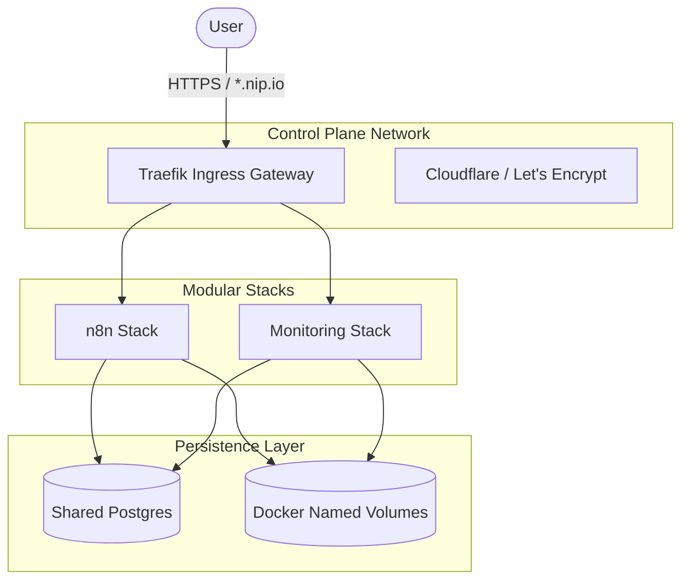

# ☁️ CloudOps-Sandbox
## A Production-Grade Local Cloud Architecture

A modular, automated infrastructure sandbox for testing cloud-native stacks, observability, and automation tools on your laptop or a remote VM.

> [!TIP]
> This lab mimics a production cloud environment with modular stacks and unified ingress.

## 🏗️ Architecture: The "Local Cloud" Design

Unlike standard local labs, **CloudOps-Sandbox** is built with a platform engineering mindset. It separates ingress, control-plane logic, and modular application stacks.


```mermaid
graph TD
    User([User]) -->|HTTPS / *.nip.io| Traefik[Traefik Ingress Gateway]
    
    subgraph "Control Plane Network"
        Traefik
        DNS[Cloudflare / Let's Encrypt]
    end

    subgraph "Modular Stacks"
        App1[n8n Stack]
        App2[Monitoring Stack]
    end

    subgraph "Persistence Layer"
        DB[(Shared Postgres)]
        Vol[(Docker Named Volumes)]
    end

    Traefik --> App1
    Traefik --> App2
    
    App1 --> DB
    App2 --> DB
    
    App1 --> Vol
    App2 --> Vol
```

## 🚀 Overview

This lab provides a "Sandboxed" environment that mimics a production cloud setup. It allows for the rapid deployment of stateful tools and management stacks using Docker and Traefik as a unified entry point.

## 📋 Prerequisites

### System Requirements
*   **Operating System**: macOS or Linux.
*   **Docker**: Docker Desktop (Mac) or Docker Engine (Linux).
*   **Tools**: `git`, `docker`, `docker compose`, `make`, `envsubst` (via `gettext` package on Linux), `openssl` (used by `make gen-secrets`; preinstalled on macOS and most Linux distros).
*   **CPU**: Modern `x86_64` recommended. Some upstream images may require `x86-64-v2` support. If your host is older, pin compatible image tags before first boot.

### Supported Install Mode
This repository is documented and supported for **fresh installs**.

If you want to reinstall the lab, remove the existing containers and named volumes first, then generate a new `.env` and install again. Reusing old volumes with new secrets is not part of the default workflow.

---

## 🏗️ Stack Catalog

The lab is organized into modular stacks:

| Category | Tools | Description |
| :--- | :--- | :--- |
| **Edge & Proxy** | Traefik | Wildcard SSL and Auto-Discovery |
| **Databases** | PostgreSQL | Stateful data persistence (backs Grafana and n8n) |
| **Observability** | Prometheus, Grafana | Metrics and Dashboards |
| **Automation** | n8n | Low-code workflow automation |

This is the good-to-get-started set. Want Keycloak, a second DB engine
(MySQL, Adminer, phpMyAdmin), Portainer/WUD, or Cloudflare Tunnel for
public access without port-forwarding? Check out the [`advanced`
branch](https://github.com/chinmaymjog/cloudops-sandbox/tree/advanced) -
the same lab with those added, plus opt-in Docker Compose profiles for
each so you don't pay for what you don't want by default.

---

## 🛠️ Quick Start

Start here if you just want the working path:

1. clone the repo
2. copy `.env`
3. run `make gen-secrets` to fill in random passwords/keys
4. run `make setup`
5. run `make up`
6. run `make status`

### What You Edit

Only edit these files for normal setup and customization:

- `.env`
- `.env.template`
- `stacks/<app-name>/.env.template`
- `stacks/<app-name>/docker-compose.yml`

Do not assume any generated env file needs manual edits. Re-run `make setup` after changing templates or root env values.

Two stacks also ship a hand-edited (not templated) config file for advanced tuning:
`stacks/traefik/conf/traefik.yml` (e.g. the ACME registration email) and
`stacks/prometheus/conf/prometheus.yml` (scrape targets). Changes to these take
effect on the next `docker compose ... up -d` — no `make setup` needed.

### 1. Get The Code
Clone the repository locally with HTTPS:
```bash
git clone https://github.com/chinmaymjog/cloudops-sandbox.git
cd cloudops-sandbox
```

Note: this repository must be readable from the target machine. If HTTPS clone prompts for GitHub credentials, use an account that has access to the repository or use an SSH clone URL with a configured GitHub key.

If you plan to customize the lab and keep your own changes, fork first and clone your fork instead.
If you already use GitHub SSH keys on the target machine, you can use the SSH clone URL instead.

> [!IMPORTANT]
> `APP_DOMAIN` and any app-specific secret values must be present before `make up`.
> If you add a new stack, wire its variables through the stack template first, then regenerate with `make setup`.

### 2. Initialize Environment
Copy the global template:
```bash
cp .env.template .env
```

Then fill in random values for every password/key still at its placeholder default:
```bash
make gen-secrets
```
This only touches values that still match the `.env.template` default, so it's
safe to run again later — anything you've already customized is left alone.
It covers `POSTGRES_PASSWORD`, `N8N_DB_PASSWORD`, `GRAFANA_DB_PASSWORD`,
`GRAFANA_ADMIN_PASSWORD`, and `N8N_ENCRYPTION_KEY`. It does not touch
`APP_DOMAIN`, image tags, or any Cloudflare credentials — those come from you
or your Cloudflare account, not from a generator.

> [!IMPORTANT]
> `GRAFANA_ADMIN_PASSWORD` only takes effect on Grafana's first boot. If
> Grafana has already started once (even with the placeholder value, which
> means it's running on the well-known default `admin`/`admin`), changing
> this env var and recreating the container will **not** change an
> already-created admin account's password. Fix a running instance with
> `docker exec grafana grafana-cli admin reset-admin-password <new-password>`.

### 3. Choose Setup Mode

#### Mode A (Recommended): Local Laptop with nip.io
`APP_DOMAIN=127.0.0.1.nip.io` is already the `.env.template` default. Run
`make gen-secrets` (see step 2 above) to fill in the required passwords/keys:
- `POSTGRES_PASSWORD`
- `N8N_DB_PASSWORD`
- `GRAFANA_DB_PASSWORD`
- `GRAFANA_ADMIN_PASSWORD`
- `N8N_ENCRYPTION_KEY`

Expected access examples:
- `https://grafana.127.0.0.1.nip.io`
- `https://n8n.127.0.0.1.nip.io`

Note: nip.io mode is for routing convenience, not trusted public TLS. Traefik will serve a default certificate in this mode, so browser certificate warnings are expected.

#### Mode B: Remote VM with nip.io
Set in `.env`:
- `APP_DOMAIN=<VM_PUBLIC_IP>.nip.io`
- Same secret values as Mode A

VM preflight:
1. Open inbound ports `80` and `443` on the VM firewall/security group.
2. Ensure Docker is running.

Expected access examples:
- `https://grafana.<VM_PUBLIC_IP>.nip.io`
- `https://n8n.<VM_PUBLIC_IP>.nip.io`

Note: as with local nip.io mode, browser certificate warnings are expected. Use Mode C if you need publicly trusted certificates.

#### Mode C (Optional Advanced): Public Domain with Cloudflare
Use this mode only if you want DNS-challenge based certificates.

Set in `.env`:
- `APP_DOMAIN=lab.yourdomain.com`
- `CF_API_EMAIL` (uncomment in `.env.template`)
- `CF_DNS_API_TOKEN` (uncomment in `.env.template`)
- Same secret values as Mode A

DNS preflight:
1. Create wildcard DNS record `*.lab.yourdomain.com` to `127.0.0.1` (local) or VM public IP (remote).
2. Token permissions should include DNS edit capability for the zone.

Want to expose the lab publicly without opening any router ports, using
a Cloudflare Tunnel? That's Mode D on the [`advanced`
branch](https://github.com/chinmaymjog/cloudops-sandbox/tree/advanced).

### 4. Setup Infrastructure
Generate stack env files and network:
```bash
make setup
```

### 5. Launch Stack
Start the lab:
```bash
make up
```

The first boot can take a few minutes because Docker may need to pull multiple images.

### 6. Verify Health
```bash
make status
docker ps
```

On a fresh install, wait until core services are `Up` before opening routes in the browser.

### 7. First Login (Recommended)
Start with Traefik dashboard:
- `https://traefik.<APP_DOMAIN>`

Then verify core apps:
- `https://grafana.<APP_DOMAIN>`
- `https://n8n.<APP_DOMAIN>`

By default, the lab does not add Traefik basic auth in front of any routes. If you expose the lab outside a trusted network, add your own access controls before using it as a shared endpoint.

### 8. Reinstall Cleanly
If you want a new install with new secrets, remove the existing deployment first:
```bash
make down
docker volume rm pgsql-data grafana-data n8n-data prometheus-data traefik-log traefik-certs
docker network rm control-plane
```

Then create a fresh `.env`, run `make setup`, and run `make up` again.

### 9. Database Syncing
This is optional and only needed when you add or change a DB-backed app.

If you add a new DB-backed app while the lab is already running, run:
```bash
make sync-dbs
```
This safely provisions new databases and users without restarting the DB engine.

### 10. Onboard a New Stack/App

Use this flow for any new stack under `stacks/<app-name>/`.

#### 10.1 Create stack files

Create a new folder and add these templates:

`stacks/<app-name>/.env.template`
```env
# Example app runtime config
APP_TAG=${APP_TAG}
APP_DOMAIN=${APP_DOMAIN}
APP_DB_PASSWORD=${APP_DB_PASSWORD}
```

`stacks/<app-name>/docker-compose.yml`
```yaml
services:
    <app-name>:
        image: <image-repo>:${APP_TAG}
        container_name: <app-name>
        restart: unless-stopped
        env_file:
            - .env
        environment:
            APP_DOMAIN: ${APP_DOMAIN}
            APP_DB_PASSWORD: ${APP_DB_PASSWORD}
        labels:
            - "traefik.enable=true"
            - "traefik.http.routers.<app-name>.rule=Host(`<app-name>.${APP_DOMAIN}`)"
            - "traefik.http.routers.<app-name>.entrypoints=websecure"
            - "traefik.http.routers.<app-name>.tls=true"
            - "traefik.http.services.<app-name>.loadbalancer.server.port=80"
        networks:
            - control-plane

networks:
    control-plane:
        external: true
```

#### 10.2 Add root variables

In root `.env`, add only variables your new stack needs, for example:

```env
APP_TAG=latest
APP_DB_PASSWORD=<strong-password>
```

#### 10.3 Regenerate stack env files and start app

Any stack with `docker-compose.yml` is automatically picked up by startup scripts.

```bash
make setup
docker compose -f stacks/<app-name>/docker-compose.yml up -d
```

Or launch all stacks:

```bash
make up
```

#### 10.4 Verify app

```bash
docker ps --format '{{.Names}}\t{{.Status}}' | grep <app-name>
docker logs --tail 100 <app-name>
```

If you added Traefik labels, verify:

- `https://<app-name>.<APP_DOMAIN>`

#### 10.5 DB-backed app extension (PostgreSQL)

If the app needs a new DB/user, wire the password through DB runtime and init script.

1. Add password key in root `.env` (example: `DEMO_DB_PASSWORD=...`).
2. Add `DEMO_DB_PASSWORD=$DEMO_DB_PASSWORD` to `stacks/pgsql/.env.template`.
3. Add `DEMO_DB_PASSWORD: ${DEMO_DB_PASSWORD}` to `stacks/pgsql/docker-compose.yml` under postgres `environment`.
4. Add provisioning line in `stacks/pgsql/init-db.d/init-databases.sh`:
     - `create_user_and_database "demo" "demo" "${DEMO_DB_PASSWORD}"`
5. Apply without resetting DB volumes:

```bash
make setup
make sync-dbs
```

6. Validate:

```bash
docker exec -i postgresql psql -U postgres -d postgres -tAc "SELECT 1 FROM pg_database WHERE datname='demo';"
docker exec -i postgresql psql -U postgres -d postgres -tAc "SELECT 1 FROM pg_roles WHERE rolname='demo';"
```

---

## 🧰 Helpful Commands

```bash
make gen-secrets # fill in random values for any password/key still at its template default
make setup      # regenerate stack env files
make up         # start all stacks
make down       # stop all stacks
make status     # container status snapshot
make sync-dbs   # sync postgres users and databases
```

---
*Maintained by [Chinmay Jog](https://github.com/chinmaymjog) | 📖 [Read my articles on Medium](https://medium.com/@chinmaymjog)*
