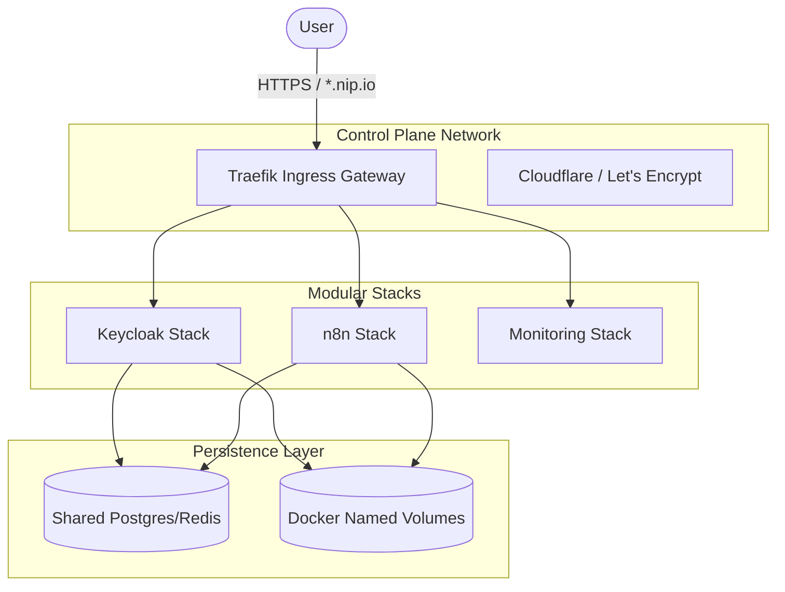

# ☁️ CloudOps-Sandbox
## A Production-Grade Local Cloud Architecture

A modular, automated infrastructure sandbox for testing cloud-native stacks, observability, and automation tools on your laptop or a remote VM.

> [!TIP]
> This lab mimics a production cloud environment with modular stacks and unified ingress.

## 🏗️ Architecture: The "Local Cloud" Design

Unlike standard local labs, **CloudOps-Sandbox** is built with a platform engineering mindset. It separates ingress, control-plane logic, and modular application stacks.


```mermaid
graph TD
    User([User]) -->|HTTPS / *.nip.io| Traefik[Traefik Ingress Gateway]
    
    subgraph "Control Plane Network"
        Traefik
        DNS[Cloudflare / Let's Encrypt]
    end

    subgraph "Modular Stacks"
        App1[Keycloak Stack]
        App2[n8n Stack]
        App3[Monitoring Stack]
    end

    subgraph "Persistence Layer"
        DB[(Shared Postgres/Redis)]
        Vol[(Docker Named Volumes)]
    end

    Traefik --> App1
    Traefik --> App2
    Traefik --> App3
    
    App1 --> DB
    App2 --> DB
    
    App1 --> Vol
    App2 --> Vol
```

## 🚀 Overview

This lab provides a "Sandboxed" environment that mimics a production cloud setup. It allows for the rapid deployment of stateful tools and management stacks using Docker and Traefik as a unified entry point.

## 📋 Prerequisites

### System Requirements
*   **Operating System**: macOS or Linux.
*   **Docker**: Docker Desktop (Mac) or Docker Engine (Linux).
*   **Tools**: `make`, `envsubst` (via `gettext` package on Linux).

---

## 🏗️ Stack Catalog

The lab is organized into modular stacks:

| Category | Tools | Description |
| :--- | :--- | :--- |
| **Edge & Proxy** | Traefik | Wildcard SSL, Basic Auth, and Auto-Discovery |
| **Observability** | Prometheus, Grafana, WUD | Metrics, Dashboards, and Update Notifications |
| **Automation** | n8n | Low-code workflow automation |
| **Databases** | PostgreSQL, MySQL | Stateful data persistence |
| **Identity** | Keycloak | Identity and Access Management (OIDC/SAML) |
| **Management** | Portainer, Adminer, phpMyAdmin | Container and DB management UIs |

---

## 🛠️ Quick Start

### 1. Initialize Environment
Copy the global template:
```bash
cp .env.template .env
```

### 2. Choose Setup Mode

#### Mode A (Recommended): Local Laptop with nip.io
Set the minimum required values in `.env`:
- `APP_DOMAIN=127.0.0.1.nip.io`
- `BASIC_AUTH`
- `POSTGRES_PASSWORD`
- `N8N_DB_PASSWORD`
- `GRAFANA_DB_PASSWORD`
- `MYSQL_ROOT_PASSWORD`
- `N8N_ENCRYPTION_KEY`
- `KEYCLOAK_ADMIN`
- `KEYCLOAK_ADMIN_PASSWORD`
- `KEYCLOAK_DB_PASSWORD`

Generate `BASIC_AUTH` (example):
```bash
echo $(htpasswd -nb user password) | sed -e s/\$/\$\$/g
```

Expected access examples:
- `https://grafana.127.0.0.1.nip.io`
- `https://keycloak.127.0.0.1.nip.io`
- `https://n8n.127.0.0.1.nip.io`

Note: nip.io mode works with default/self-signed cert behavior, so browser certificate warnings are expected.

#### Mode B: Remote VM with nip.io
Set in `.env`:
- `APP_DOMAIN=<VM_PUBLIC_IP>.nip.io`
- Same secret values as Mode A

VM preflight:
1. Open inbound ports `80` and `443` on the VM firewall/security group.
2. Ensure Docker is running.

Expected access examples:
- `https://grafana.<VM_PUBLIC_IP>.nip.io`
- `https://keycloak.<VM_PUBLIC_IP>.nip.io`
- `https://n8n.<VM_PUBLIC_IP>.nip.io`

#### Mode C (Optional Advanced): Public Domain with Cloudflare
Use this mode only if you want DNS-challenge based certificates.

Set in `.env`:
- `APP_DOMAIN=lab.yourdomain.com`
- `CF_API_EMAIL` (uncomment in `.env.template`)
- `CF_DNS_API_TOKEN` (uncomment in `.env.template`)
- Same secret values as Mode A

DNS preflight:
1. Create wildcard DNS record `*.lab.yourdomain.com` to `127.0.0.1` (local) or VM public IP (remote).
2. Token permissions should include DNS edit capability for the zone.

### 3. Setup Infrastructure
Generate stack env files and network:
```bash
make setup
```

### 4. Launch Stack
Start the full lab:
```bash
make up
```

### 5. Verify Health
```bash
make status
docker ps
```

### 6. First Login (Recommended)
Start with Traefik dashboard:
- `https://traefik.<APP_DOMAIN>`

Then verify core apps:
- `https://grafana.<APP_DOMAIN>`
- `https://keycloak.<APP_DOMAIN>`
- `https://n8n.<APP_DOMAIN>`

### 7. Database Syncing (Optional)
If you add a new DB-backed app while the lab is already running, run:
```bash
make sync-dbs
```
This safely provisions new databases and users without restarting the DB engine.

---

## 🔌 Optional Integrations

WUD Slack notifications are optional.
These variables are commented out in `.env.template` by default.
Only uncomment/configure them if you want Slack alerts for image updates:
- `WUD_TRIGGER_SLACK_SUPPORT_TOKEN`
- `WUD_TRIGGER_SLACK_SUPPORT_CHANNEL`
- `WUD_TRIGGER_SLACK_SUPPORT_THRESHOLD`

---

## 🧰 Helpful Commands

```bash
make setup      # regenerate stack env files
make up         # start all stacks
make down       # stop all stacks
make status     # container status snapshot
make sync-dbs   # sync postgres/mysql users and databases
```

---
*Maintained by [Chinmay Jog](https://github.com/chinmaymjog) | 📖 [Read my articles on Medium](https://medium.com/@chinmaymjog)*
